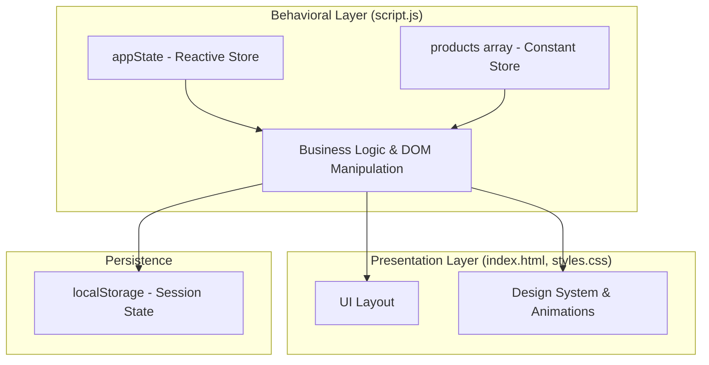
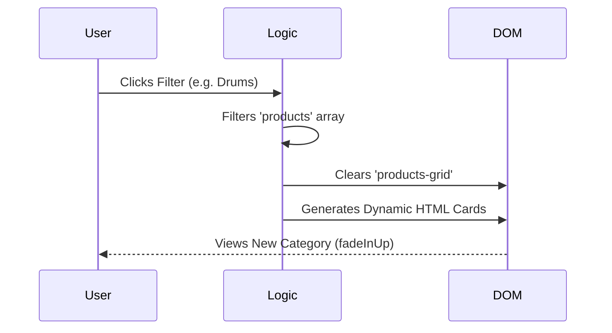
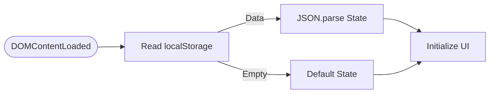

# 📋 Neon Beats: Technical Project Report

## 1. Executive Summary
**Neon Beats** is a high-fidelity, single-page application (SPA) prototype of a premium music store. This project showcases modern web development techniques including **Glassmorphism**, specialized CSS effects, and robust state management using vanilla JavaScript. It was developed to provide a seamless, high-performance shopping experience without the overhead of external frameworks.

---

## 2. System Architecture

The project follows a clean **Monolithic Frontend Architecture**. All core concerns are separated into specialized layers:



---

## 3. Core Technical Features

### 3.1 Reactive State Management
Instead of complex state libraries, Neon Beats utilizes a centralized `appState` object. This pattern ensures that the "Source of Truth" is always consistent across the UI:

```javascript
const appState = {
  cart: [],           // Persistent shopping basket
  filter: 'all',      // Active category filter state
  searchQuery: ''      // Reserved for future search functionality
};
```

### 3.2 Dynamic Product Rendering
The `renderProducts()` function is the engine of the store. It utilizes a **staggered animation pattern** to ensure the UI feels alive. When a filter is changed, the system clears the DOM and re-animates elements with a calculated delay:



### 3.3 Glassmorphism Design System
The visual identity relies on **Advanced CSS3**. Key properties used include:
- `backdrop-filter: blur(12px)`
- `linear-gradient` with low-alpha overlays
- `rgba(255, 255, 255, 0.05)` backgrounds

---

## 4. Key Logic Traces

### 4.1 "Add to Cart" Sequence
1. **Trigger**: User clicks the cart icon button (`onclick="addToCart('p1')"`).
2. **Analysis**: Logic checks if the product ID already exists in `appState.cart`.
3. **Branch**:
    - **Exists**: Increments the `quantity` property.
    - **New**: Pushes a cloned product object with `quantity: 1`.
4. **Sync**: Triggers `updateCartUI()` to refresh the sidebar and `localStorage` to persist the session.

### 4.2 Checkout Simulation
A multi-stage sequence involving **DOM manipulation masks**. The system simulates a backend delay (1.5s) using `setTimeout`, showing a loading spinner before clearing the state and presenting a success modal.

---

## 5. Persistence Strategy
To maintain a professional UX, the cart state is serialized and stored in `localStorage`. 



---

## 6. Conclusion
Neon Beats demonstrates that professional-grade interactvity and aesthetics can be achieved using **Vanilla Web Technologies**. By utilizing structured state management and modern CSS, the system performs with virtually zero latency and provides a premium, immersive user experience ready for real-world API integration.
